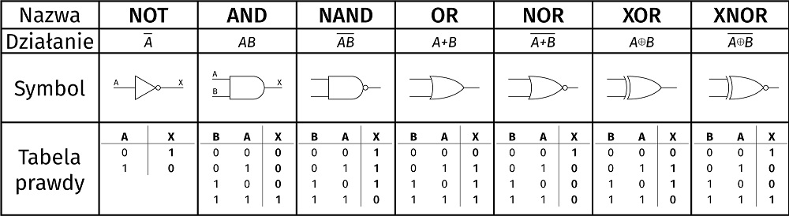

# Programowanie obiektowe 19.09.2024

### Spis treści:
#### - `Typy bramek logicznych`

---

**#Typy bramek logicznych**
- AND
- OR
- NO
- XOR

---

**Obrazek wizualizujący**

*Uwaga! wejść może być więcej*

---

